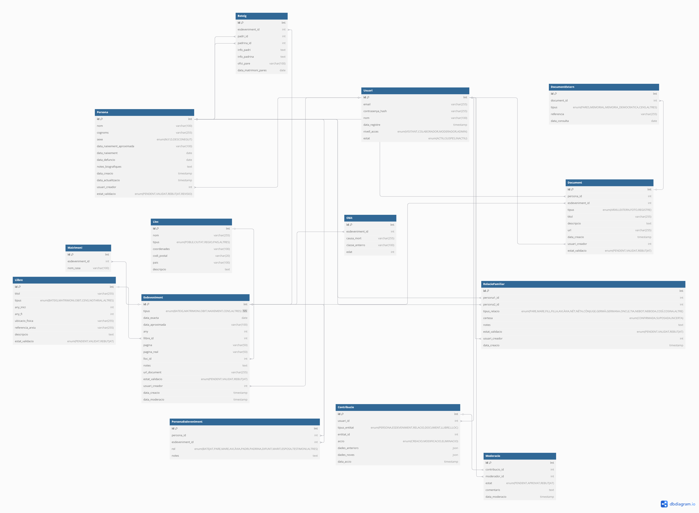

# Base de Dades Genealògica - Documentació Tècnica Completa



## 1. Taula `Usuari`

### 📝 Descripció
Gestiona l'accés i permisos de tots els usuaris del sistema.

### 🗂 Estructura

| Camp                | Tipus          | Descripció                                                                                     | Restriccions                                  |
|---------------------|----------------|------------------------------------------------------------------------------------------------|-----------------------------------------------|
| `id`               | SERIAL/INTEGER | Identificador únic autoincremental                                                             | **PK**                                       |
| `email`            | VARCHAR(255)   | Adreça electrònica única                                                                       | `UNIQUE`, `NOT NULL`                         |
| `contrasenya_hash` | VARCHAR(255)   | Hash de contrasenya (bcrypt/scrypt)                                                           | `NOT NULL`                                   |
| `data_registre`    | TIMESTAMP      | Data de registre automàtica                                                                    | `DEFAULT CURRENT_TIMESTAMP`                  |
| `nivell_acces`     | ENUM           | `VISITANT` (només lectura)<br>`COLABORADOR` (afegir dades)<br>`MODERADOR`<br>`ADMIN`          | `DEFAULT 'VISITANT'`                         |
| `estat`           | ENUM           | `ACTIU`<br>`SUSPES` (temporal)<br>`INACTIU` (definitiu)                                        | `DEFAULT 'ACTIU'`                            |

### 🔗 Relacions
- **1:N** amb `Persona`, `Esdeveniment`, `Document`
- **1:1** amb `Moderacio` (com a moderador)

### ⚙️ Configuració PostgreSQL
```sql
CREATE TYPE nivell_acces_type AS ENUM ('VISITANT', 'COLABORADOR', 'MODERADOR', 'ADMIN');
CREATE TYPE estat_usuari_type AS ENUM ('ACTIU', 'SUSPES', 'INACTIU');
```

## ⚙️ Configuració Específica per SQLite

### 1. Simulació de Tipus ENUM
Per a les columnes que requereixen valors predefinits:

```sql
-- Per a la taula Usuari
CREATE TABLE Usuari (
    nivell_acces TEXT CHECK (nivell_acces IN ('VISITANT', 'COLABORADOR', 'MODERADOR', 'ADMIN')),
    estat TEXT CHECK (estat IN ('ACTIU', 'SUSPES', 'INACTIU'))
);

-- Per a la taula Esdeveniment
CREATE TABLE Esdeveniment (
    tipus TEXT CHECK (tipus IN ('BATEIG', 'MATRIMONI', 'OBIT', 'NAIXEMENT', 'CENS', 'ALTRES'))
);
```

## 2. Habilitació de Claus Foranes

**Necessari executar en cada connexió**:
```sql
PRAGMA foreign_keys = ON;
```

## 3. Gestió de Timestamps Automàtics
```sql
-- Trigger per actualitzar data_actualitzacio en Persona
CREATE TRIGGER persona_update_timestamp
AFTER UPDATE ON Persona
BEGIN
    UPDATE Persona SET data_actualitzacio = datetime('now') WHERE id = NEW.id;
END;

-- Trigger equivalent per Esdeveniment
CREATE TRIGGER esdeveniment_update_timestamp
AFTER UPDATE ON Esdeveniment
BEGIN
    UPDATE Esdeveniment SET data_actualitzacio = datetime('now') WHERE id = NEW.id;
END;
```

## 4. Gestió de JSON (emmagatzematge com TEXT)
```sql
-- A la taula Contribucio
CREATE TABLE Contribucio (
    dades_anteriors TEXT,  -- Emmagatzema JSON com a text
    dades_noves TEXT,
    
    -- Validació bàsica de format JSON
    CHECK (json_valid(dades_anteriors)),
    CHECK (json_valid(dades_noves))
);
```

## 5. Índexs per a Millorar Rendiment
    ```sql
    -- Índex per cerca de cognoms (sensibilitat a majúscules/minúscules)
    CREATE INDEX idx_persona_cognoms ON Persona(cognoms COLLATE NOCASE);

    -- Índex compost per cerques freqüents
    CREATE INDEX idx_esdeveniment_dates ON Esdeveniment(tipus, any, data_exacta);
    ```

## 6. Restriccions Addicionals
    ```sql
    -- Evitar auto-relacions en RelacioFamiliar
    CREATE TRIGGER prevent_self_relation
    BEFORE INSERT ON RelacioFamiliar
    BEGIN
        SELECT CASE
            WHEN NEW.persona1_id = NEW.persona2_id THEN
                RAISE(ABORT, 'No es permeten auto-relacions')
        END;
    END;

    -- Validació de dates coherents
    CREATE TRIGGER validate_persona_dates
    BEFORE INSERT ON Persona
    BEGIN
        SELECT CASE
            WHEN NEW.data_naixement > date('now') THEN
                RAISE(ABORT, 'Data de naixement futura no vàlida')
            WHEN NEW.data_defuncio > date('now') THEN
                RAISE(ABORT, 'Data de defunció futura no vàlida')
            WHEN NEW.data_naixement > NEW.data_defuncio THEN
                RAISE(ABORT, 'Data de naixement posterior a defunció')
        END;
    END;
    ```

## 7. Inicialització Recomanada
    ```sql
    -- Script d'inici recomanat
    PRAGMA journal_mode = WAL;  -- Millor rendiment en escriptures
    PRAGMA synchronous = NORMAL; -- Equilibri entre seguretat i rendiment
    PRAGMA foreign_keys = ON; -- Habilitar claus foranes
    PRAGMA busy_timeout = 30000;  -- 30 segons d'espera en bloquejos
    ```

## Nota Important sobre SQLite

### 🔴 Limitacions a tenir en compte

1. **Suport de tipus de dades**:
   - No suporta veritables tipus ENUM (s'han de simular amb constraints CHECK)
   - Tipus bàsics implementats:
     - `INTEGER`: Valors numèrics sencers
     - `REAL`: Nombres en coma flotant
     - `TEXT`: Cadenes de caràcters
     - `BLOB`: Dades binàries
     - `NULL`: Valor nul

2. **Gestió de JSON**:
   ```sql
   -- S'emmagatzema com TEXT amb validació opcional
   CREATE TABLE exemple_json (
       dades TEXT CHECK(json_valid(dades))
   );
   ```